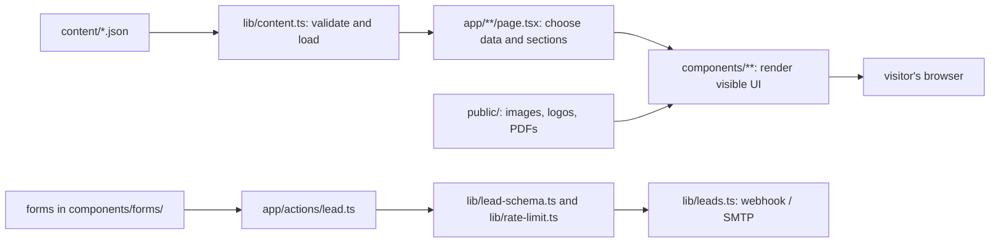

# Scientific Dental: architecture and editing map

This is a guide to the files that make the site, with the shortest path to common text changes. The site uses **Next.js 16 App Router, React 19, TypeScript, Tailwind CSS 4, and JSON content**. The public website is in Portuguese; this guide is in English for maintainers.

## Start here when changing text

| Text you see | First place to edit | Also check |
| --- | --- | --- |
| Address, phone, WhatsApp number, email, opening hours, company facts, territories, Legacy SD name/link, Morita notice | `content/site.json` | `app/layout.tsx` for the default browser title; `lib/whatsapp.ts` for prefilled message wording |
| Product name, description, specification, gallery caption, image alt text, related products | `content/products/<product-slug>.json` | `components/product/ProductPage.tsx` for labels shared by every product |
| Product category name/description or menu category | `content/categories.json` | `app/produtos/page.tsx` for the catalog introduction; `app/produtos/[slug]/page.tsx` for category page labels |
| Article/case title, excerpt, date, source, archive note | `content/articles.json` | `app/conteudo/page.tsx` and `app/conteudo/[slug]/page.tsx` for shared page wording |
| Quote options, step names, success wording | `content/forms.json` | `app/orcamento/page.tsx`, `components/forms/QuoteWizard.tsx`, `components/forms/LeadForm.tsx`, `components/forms/Field.tsx` for headings and field labels |
| Home headline, introduction, calls to action | `components/home/Hero.tsx` and the other `components/home/*.tsx` files | `app/page.tsx` for section order and home SEO title/description |
| Top navigation wording | `components/site/Header.tsx` (`NAV` and other JSX labels) | `content/categories.json` for category names and `app/layout.tsx` for data passed to the header |
| Footer headings/links | `components/site/Footer.tsx` | `content/site.json` for the contact values displayed there |
| Contact, support, about, Legacy, or privacy page prose | Matching `app/<route>/page.tsx` | `content/site.json` for shared company details |
| Floating WhatsApp button wording | `components/site/WhatsAppButton.tsx` | `lib/whatsapp.ts` for the message sent when clicked |
| Error page currently open in the IDE | `app/global-error.tsx` | `app/error.tsx` handles ordinary route errors; `app/not-found.tsx` handles 404 |
| Search result title/description | `metadata` or `generateMetadata` in the matching `app/**/page.tsx` | `app/layout.tsx` for defaults, `lib/seo.ts` for the shared metadata function, `content/site.json` for the global description |
| Old `/sd/...` URL destination | `content/redirects.json` | `next.config.ts` reads the map; `app/sd/[[...rest]]/page.tsx` handles unmatched old URLs |
| Colors, fonts, spacing, responsive behavior | `app/globals.css` | `docs/DESIGN-PLAN.md` before changing visual design |

**Practical rule:** JSON holds most reusable facts and catalog records. Page-specific prose and UI labels often live directly in `.tsx` files. If a phrase is not in `content/`, search for its exact words in `app/` and `components/`.

## How a page is assembled



`app/layout.tsx` wraps every page with the header, footer, floating WhatsApp button, cookie panel, fonts, and organization structured data. `app/page.tsx` composes the home sections. Each route folder under `app/` maps to a URL. The dynamic routes `[slug]` use a slug from JSON; `generateStaticParams` builds the known pages, and `dynamicParams = false` makes unknown slugs a 404. In `/produtos/[slug]`, category slugs are checked before product slugs, so they must remain unique across both sets.

`"use client"` at the top of a component means it runs interactive browser code. Most pages load data on the server; interactive pieces include menus, gallery, catalog filters, cookie consent, and forms. `"use server"` in `app/actions/lead.ts` marks the form submission function. The site does not have a content management admin screen or a database for catalog content: edit files and rebuild/deploy. In `npm run dev`, saved edits appear during development.

## Folder and file inventory

### `app/`: routes, shared shell, errors, SEO

| File | Function / when to edit |
| --- | --- |
| `app/layout.tsx` | Root HTML and shared chrome; font setup, default metadata, header/footer/WhatsApp/cookie wiring. Edit default tab title or shared skip link here. |
| `app/globals.css` | Tailwind import, design tokens, global classes, typography and visual effects. |
| `app/page.tsx` | `/` home assembly, section order, home metadata, chosen category image. Most home text is in `components/home/`. |
| `app/produtos/page.tsx` | `/produtos` catalog hub introduction, SEO, final quote prompt. |
| `app/produtos/[slug]/page.tsx` | Both `/produtos/<category>` and `/produtos/<product>`; static slugs, category list layout, product template call, per-item SEO. |
| `app/conteudo/page.tsx` | `/conteudo` article index introduction and cards. |
| `app/conteudo/[slug]/page.tsx` | `/conteudo/<article>` archive-summary page, date/source, related articles, metadata. Full article bodies are not stored here yet. |
| `app/orcamento/page.tsx` | `/orcamento` introduction, reassurance facts, wizard mounting, product/category query prefill map. |
| `app/suporte/page.tsx` | `/suporte` service prose, support details, lead form. |
| `app/contato/page.tsx` | `/contato` channels, address/hours, contact lead form. |
| `app/a-scientific/page.tsx` | `/a-scientific` company history, principles, brands and team presentation. |
| `app/legacy-sd/page.tsx` | `/legacy-sd` program explanation and WhatsApp CTA. |
| `app/privacidade/page.tsx` | `/privacidade` privacy-policy body. Version shown there comes from `lib/leads.ts`. Review policy edits with the responsible business/legal owner. |
| `app/actions/lead.ts` | Shared server action for all forms: parse, validate, rate-limit, deliver, and return status. |
| `app/error.tsx` | Error UI for an ordinary route/render failure; `reset()` retries. |
| `app/global-error.tsx` | Last-resort error UI when the root layout fails; includes its own `<html>` and `<body>`, so its text and inline styles are self-contained. |
| `app/not-found.tsx` | 404 page and message. |
| `app/sitemap.ts` / `app/robots.ts` | Generate `/sitemap.xml` and `/robots.txt` from static routes and JSON records. |
| `app/sd/[[...rest]]/page.tsx` | Catchall redirect for old `/sd/...` pages absent from the explicit redirect map. |
| `app/sd/wp-json/[[...rest]]/route.ts` / `app/sd/xmlrpc.php/route.ts` | Return HTTP 410 for obsolete WordPress endpoints. These are request handlers, not visible pages. |
| `app/icon.svg` / `app/apple-icon.png` / `app/opengraph-image.png` | Favicon, Apple icon and default social preview. Brand script can regenerate them. |

### `components/`: reusable UI and page sections

| File | Function / text location |
| --- | --- |
| `components/home/Hero.tsx` | Home top banner: headline, introductory paragraph, trust bullets, CTA labels, hero image and alt text. |
| `components/home/MoritaNotice.tsx` | Morita statement from `site.json`; brand tile details/roles are hardcoded here. |
| `components/home/CategoryPlate.tsx` | Home category cards; names/descriptions and featured product slugs come from JSON; section heading is here. |
| `components/home/SupportSection.tsx` | Home service pitch and territory grid; some labels here, values from `site.json`. |
| `components/home/TrustBand.tsx` | Home credibility numbers and explanatory copy; years/team numbers from `site.json`. |
| `components/home/LegacyTeaser.tsx` | Home Legacy SD preview; some program values from `site.json`. |
| `components/home/LatestContent.tsx` | Latest article cards and section heading; records from `articles.json`. |
| `components/home/CtaBand.tsx` | Final home CTA and phone/hours panel. |
| `components/site/Header.tsx` | Desktop/mobile navigation, product menu, header CTA; `NAV` defines top-level labels. |
| `components/site/Footer.tsx` | Footer navigation, contact display, legal line, cookie-settings link. |
| `components/site/Logo.tsx` | Chooses normal/inverse logo from `public/brand/`. |
| `components/site/WhatsAppButton.tsx` | Floating WhatsApp UI and product context. |
| `components/site/CookieConsent.tsx` | Cookie message, controls, remembered choice, optional GTM load. |
| `components/site/JsonLd.tsx` | Writes structured data into page HTML. Data builders live in `lib/seo.ts`. |
| `components/product/ProductPage.tsx` | Shared product-detail layout and common labels; reads one product JSON object. |
| `components/product/ProductCard.tsx` | Product card used across catalog/category/related lists. |
| `components/product/CatalogExplorer.tsx` | Catalog filter UI; `?marca=` and `?categoria=` are shareable filter query values. |
| `components/product/ProductGallery.tsx` | Interactive image gallery. |
| `components/product/SpecTable.tsx` | Specification groups from product JSON. |
| `components/product/FovDiagram.tsx` | Field-of-view visual from `fovs` in product JSON. |
| `components/product/MobileCtaBar.tsx` | Sticky product CTA on small screens. |
| `components/forms/QuoteWizard.tsx` | Four-step quote form interaction and form-specific labels. |
| `components/forms/quote-options.ts` | Exposes the option arrays from `content/forms.json` to the wizard. |
| `components/forms/LeadForm.tsx` | Short contact/support/product form and submission feedback. |
| `components/forms/Field.tsx` | Shared fields, labels, consent checkbox text and bot trap. |
| `components/content/ArticleCard.tsx` | Article/case card and type labels. |
| `components/ui/Button.tsx` | Shared button/link styles; button text is normally supplied by the caller. |
| `components/ui/Container.tsx` | Shared horizontal page width. |
| `components/ui/Section.tsx` | Repeated section wrapper and eyebrow heading. |
| `components/ui/PageHero.tsx` | Standard inner-page banner; each page passes its own title and lead. |
| `components/ui/Breadcrumb.tsx` | Breadcrumb rendering; labels are supplied by pages. |
| `components/ui/Picture.tsx` | Responsive preprocessed product/hero images. |
| `components/ui/Viewer.tsx` | Dark clinical-image frame, scale marker and caption display. |
| `components/ui/Icons.tsx` | SVG icon components; icon shapes rather than page copy. |
| `components/ui/CurrentTime.tsx` | Current year and years-since display, based on years in `site.json`. |

### `content/`: editable records

| File | Shape / role |
| --- | --- |
| `content/site.json` | One object: company identity, address, phones (`display` and dialable `tel`), WhatsApp (`display` and digits in `e164`), email, hours, brands, Morita notice, territories, team, support text, Legacy SD. |
| `content/categories.json` | Array of 5 categories. `slug` controls URL; `name`, `description`, `specLine` control display; `flagship` lists product slugs used in highlights/menu. |
| `content/products/*.json` | 23 files, one per product; filename must equal `<slug>.json`. Simple example: `fixador.json`; rich example: `veraview-x800.json`. |
| `content/articles.json` | Array of 7 case/article summaries; `slug` controls URL. Current detail pages show archive summaries, not full article bodies. |
| `content/forms.json` | Quote options (`equipment`, `operation`, `timeline`), step names, success and consent-related text. `value` is submitted data and is validated; `label` is what visitors see. |
| `content/redirects.json` | 42 explicit old URL `source` to new `destination` mappings; loaded by `next.config.ts`. |

The 23 product files are the slugs under `content/products/`: `afastador-frontal-em-formato-de-c`, `afastador-lateral-em-formato-de-v`, `afastador-oclusal-kit-com-p-m-g`, `avental-panoramico-em-borracha-plumbifera`, `avental-periapical-com-protetor-tireoide`, `barita`, `espelhos-para-foto-oclusal-cristal-em-vidro`, `filme-dry-com-125-peliculas`, `filme-oclusal-io-41-caixa-com-25-peliculas`, `filme-periapical-e-speed-caixa-com-150-peliculas`, `filme-periapical-insight-ip-21`, `fixador`, `impressora-5700`, `impressora-5950`, `lencol-de-chumbo-1-mm-de-espessura`, `localizador-apical-root-zx-mini`, `posicionadores-autoclavaveis`, `revelador-475-ml-pronto-uso-para-consultorios`, `suporte-para-avental-de-parede`, `tri-auto-zx-2`, `veraview-x800`, `veraviewepocs-3d`, and `vidro-e-visor-plumbifero`.

Product fields: `name`, `brand`, `category`, `tagline`, `summary` and `image` build the top of a product page. Optional arrays add `gallery`, `clinicalImages`, `highlights`, `specGroups`, `fovs`, `sections`, `downloads` and `related` content. `order` controls sorting. `image.src` and download `href` point to files under `public/`. `verificar` notes record facts awaiting confirmation; these notes are not shown to visitors.

### `lib/`: application logic

| File | Responsibility |
| --- | --- |
| `lib/content.ts` | Validates JSON with Zod, loads/caches products, sorts records, finds slugs/related records, applies dimensions from image manifest. If adding content fields, update the schema here. |
| `lib/seo.ts` | Site URL, canonical/Open Graph/Twitter metadata, Organization/Breadcrumb/Product JSON-LD. |
| `lib/whatsapp.ts` | `wa.me` link builder and page-specific prefilled messages. |
| `lib/brands.ts` | Brand labels/colors/filter keys for product UI. |
| `lib/utils.ts` | Class-name joiner, date formatting, slugification. |
| `lib/lead-schema.ts` | Zod validation for lead fields and quote option values. |
| `lib/rate-limit.ts` | Form-submission limit, with Redis REST integration in production. |
| `lib/leads.ts` | Lead record, privacy policy version, SMTP/webhook delivery; development-only console fallback. |

### `public/`: files served directly

| Folder/file | Role |
| --- | --- |
| `public/images/products/` | Product photos. Many filenames have width suffixes and `.avif`, `.webp`, `.jpg` variants; these are generated versions of the same image, not separate products. |
| `public/images/hero/` | Home hero clinical image and generated variants. |
| `public/images/clinical/` | Clinical images and generated variants. |
| `public/images/manifest.json` | Generated image dimensions and variant paths; read by `lib/content.ts`. |
| `public/brand/` | Official normal/white SVG logos and PNG versions; used by `Logo.tsx`. |
| `public/downloads/catalogo-veraview-x800.pdf` | Product catalog download referenced in product JSON. |
| `public/sw.js` | One-time service-worker cleanup for older projects on the same localhost origin; this site does not run a normal offline worker. |

### Project files, scripts, tests and existing docs

| File/folder | Role |
| --- | --- |
| `package.json` / `package-lock.json` | Dependencies and exact installed versions; `npm run ...` commands. |
| `next.config.ts` | Next configuration, legacy 301 redirects, security/cache headers, image settings. |
| `tsconfig.json` | TypeScript rules and `@/` alias (`@/content/site.json` means root `content/site.json`). |
| `postcss.config.mjs` | Tailwind PostCSS plugin. |
| `eslint.config.mjs` | Lint rules. |
| `.env.example` | Template for public URL, GTM, rate-limit, webhook and SMTP variables; actual `.env.local` secrets stay local. |
| `AGENTS.md` / `CLAUDE.md` | Agent/project guidance; `AGENTS.md` requires reading installed Next docs before code edits. |
| `scripts/validate-content.mjs` | Checks duplicate/mismatched slugs, cross references and asset paths. |
| `scripts/process-images.mjs` | Takes source images, generates optimized JPEG/AVIF/WebP variants and manifest; edit its `MAP` for new source filenames. |
| `scripts/build-brand-assets.py` | Generates logos and app icons from brand originals. |
| `scripts/generate-web-config.mjs` | Creates IIS redirect config from `redirects.json` when hosting on IIS. |
| `scripts/qa-browser.py` / `scripts/qa-interactions.py` | Optional browser/layout and interaction QA scripts. |
| `tests/content-integrity.test.mjs` | Content reference and structure tests. |
| `tests/lead-schema.test.mjs` | Lead and quote validation tests. |
| `README.md` | Setup, deployment and project background. |
| `docs/DESIGN-PLAN.md` | Visual design rationale and rules. |
| `docs/REVISAO-FINAL.md` | Final review findings and limits. |
| `docs/PENDENCIAS-CLIENTE.md` | Facts still requiring client confirmation. |
| `docs/ARCHITECTURE.md` | This editing map. |

`node_modules/`, `.next/`, and `next-env.d.ts` are dependencies/generated output. They are not the source of website text. The many image variants are grouped above by family because their names differ by size and format, while their function is the same.

## Editing syntax: three concrete examples

### 1. Change a phone number in JSON

In `content/site.json`, update both the human-readable and clickable values:

```json
"sales": {
  "display": "(31) 2112-1913",
  "tel": "+553121121913"
}
```

Keep double quotes around JSON strings and commas between object fields. JSON does not allow comments or a trailing comma after the last field. The `display` value appears on screen; the `tel` value is used in `tel:` links. For WhatsApp, change `whatsapp.display` and `whatsapp.e164` together.

### 2. Change one product description

Find the URL slug, then open `content/products/<slug>.json`. For `/produtos/veraview-x800`, edit `content/products/veraview-x800.json`:

```json
"tagline": "Short line below the product name",
"summary": "Main product introduction."
```

Use the real Portuguese replacement text. Editing `name` also changes cards, breadcrumbs, metadata and quote messages. Editing `slug` changes the URL and requires changing the filename and all references to that slug; for a simple wording edit, leave `slug` alone. Do not put HTML tags in JSON strings: these fields render as plain text.

### 3. Change a hardcoded heading in TSX

In `components/home/Hero.tsx`, visible words sit between JSX tags:

```tsx
<h1>Venda e assistência técnica oficial</h1>
```

Change only the words when possible. In a prop, the text sits inside quotes, for example `title="Produtos"`. Curly braces such as `{site.phones.main.display}` mean “read this value from data”; follow the variable back to `site.json`. `className="..."` is styling, `href="..."` is a link destination, and `alt="..."` describes an image for accessibility. A page's `metadata` title/description affects search and sharing, not necessarily the visible heading, so update both if the meaning changes.

## Safe edit workflow

1. Search for the exact visible phrase in VS Code (`Ctrl+Shift+F`) or run `rg -n "phrase" app components content lib` in the terminal. Portuguese accents and punctuation matter; try a shorter distinctive substring if needed.
2. Edit the owning JSON or TSX file. Preserve the structure and avoid changing a `slug`, `value`, image path, or route unless you intend to change links/behavior.
3. Run `npm run validate:content` for content edits. It checks references and files but does not replace the Zod/type/build checks.
4. Run `npm run build` for a reliable production check, then preview the affected page. For TSX logic changes, `npm run typecheck` and `npm run lint` are also useful.
5. Deploy/rebuild to publish JSON edits. For uncertain product claims and legal copy, inspect `verificar` notes and `docs/PENDENCIAS-CLIENTE.md` before publication.

For images, place the source image in a source folder, add its filename-to-destination entry to `scripts/process-images.mjs`, run `npm run images -- <source-folder>` (or `node scripts/process-images.mjs <source-folder>`), then set the `/images/...jpg` path and meaningful `alt` in the relevant JSON or component. For a PDF, put the file in `public/downloads/` and update the product's `downloads[].href`.
